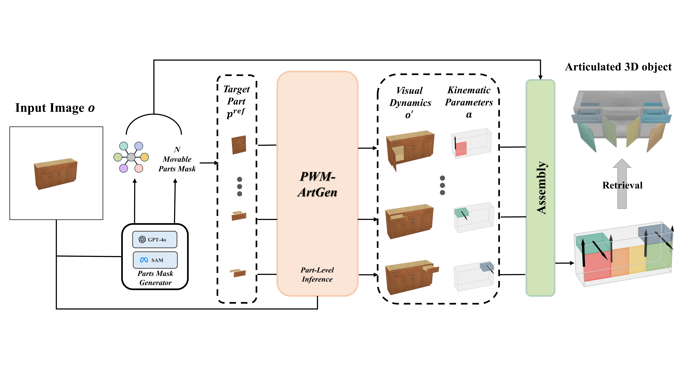

<h1 align="center">
  <strong>[ECCV 2026]
  PWM-ArtGen: Part World Model for Articulated Object Generation</strong>
</h1>

<p align="center">
  Wentao Zheng and Ancong Wu<br>
  School of Computer Science and Engineering, Sun Yat-sen University
</p>

<p align="center">
  <a href="https://arxiv.org/abs/2607.02045"></a>
</p>

<p align="center">
  
</p>

## Overview

PWM-ArtGen is a part world model for generating articulated 3D objects from a single image. The core challenge is to infer accurate kinematic structure when a static input image provides limited motion evidence. Instead of predicting kinematic parameters alone, PWM-ArtGen jointly models part-level visual dynamics and kinematic attributes, allowing dynamic visual cues and motion parameters to constrain each other during generation.

The method couples action diffusion and image diffusion with independent diffusion timesteps, enabling co-training with action-annotated data and action-free visual observations. It also introduces a Visual Dynamics Regularizer (VDR) to encourage dynamics-consistent visual representations and curates PartNet-Mobility-Reality (PM-R), a photorealistic dataset with 19.7k part-level image pairs for scalable co-training.


## Release Plan

We will release the training/inference code and model checkpoints before **September 8, 2026**.

## Citation

If you find this work useful, please cite:

```bibtex
@article{zheng2026pwmartgen,
  title   = {PWM-ArtGen: Part World Model for Articulated Object Generation},
  author  = {Zheng, Wentao and Wu, Ancong},
  journal = {arXiv preprint arXiv:2607.02045},
  year    = {2026}
}
```

## Acknowledgements

We thank [SINGAPO](https://github.com/3dlg-hcvc/singapo) and [Unified World Model](https://github.com/WEIRDLabUW/unified-world-model) for their inspiration on our model design, and [OmniPart](https://omnipart.github.io/) for inspiring our image segmentation component.


For questions, please contact us at `zhengwt28@mail2.sysu.edu.cn`.

