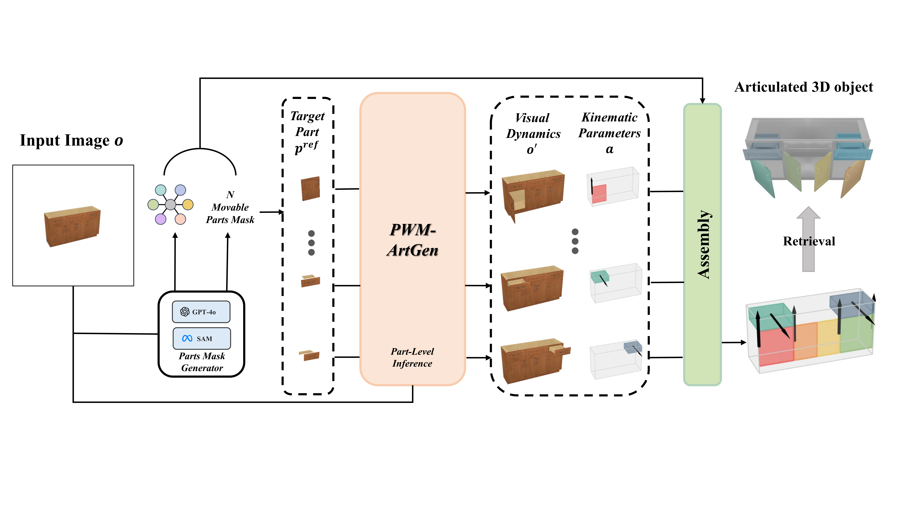

<h1 align="center">
  <strong>[ECCV 2026]
  PWM-ArtGen: Part World Model for Articulated Object Generation</strong>
</h1>

<p align="center">
  Wentao Zheng and Ancong Wu<br>
  School of Computer Science and Engineering, Sun Yat-sen University
</p>

<p align="center">
  <a href="https://arxiv.org/abs/2607.02045"></a>
  <a href="https://huggingface.co/Wentap/PWM-ArtGen"></a>
  <a href="https://huggingface.co/datasets/Wentap/PWM-ArtGen-test"></a>
</p>

<p align="center">
  
</p>

PWM-ArtGen generates articulated 3D objects from a single image by jointly modeling
part-level visual dynamics and kinematic attributes. Training and inference code,
model weights, and prepared PM/ACD test data are available below.

## Environment Setup

```bash
git clone https://github.com/Wentap123/PWM-ArtGen.git
cd PWM-ArtGen
conda create -n pwm python=3.10 -y
conda activate pwm
pip install torch==2.2.2 torchvision==0.17.2 --index-url https://download.pytorch.org/whl/cu118
pip install -r requirements.txt
```

Use this environment for training, inference, and retrieval. For evaluation,
install PyTorch3D in the same environment:

```bash
pip install ninja iopath
pip install --no-build-isolation 'git+https://github.com/facebookresearch/pytorch3d.git@V0.7.8'
```

See [environment setup](docs/setup.md) for CUDA build requirements. For image
segmentation, follow the official [SAM](https://github.com/facebookresearch/segment-anything#installation)
or [SAM3](https://github.com/facebookresearch/sam3#installation) instructions.

## Download Data

### PM and ACD test inputs

Download the prepared test sets from [Hugging Face](https://huggingface.co/datasets/Wentap/PWM-ArtGen-test).
They contain 77 PM and 134 ACD objects, with two views per object, images, masks,
bounding boxes, and part graphs. The `hf` CLI is included in the environment.

```bash
hf download Wentap/PWM-ArtGen-test pwm_pm_test.zip pwm_acd_test.zip \
  --repo-type dataset --local-dir downloads
mkdir -p data/benchmarks
unzip downloads/pwm_pm_test.zip -d data/benchmarks
unzip downloads/pwm_acd_test.zip -d data/benchmarks
```

### Meshes for retrieval and evaluation

Download the [PM package](https://aspis.cmpt.sfu.ca/projects/singapo/data/pm.zip)
and [ACD test package](https://aspis.cmpt.sfu.ca/projects/singapo/data/acd_test.zip)
provided by [SINGAPO](https://github.com/3dlg-hcvc/singapo), and extract them into
`data/raw/pm` and `data/raw/acd`. The original datasets are
[PartNet-Mobility](https://sapien.ucsd.edu/browse) and
[ACD/S2O](https://huggingface.co/datasets/3dlg-hcvc/s2o).

Convert the annotations and build the PM retrieval index:

```bash
python scripts/prepare_database.py --database_root data/raw/pm
python scripts/convert_acd_pwm.py --gt_root data/raw/acd \
  --test_ids data/benchmarks/acd/test_ids.json
```

Both test sets use PM for mesh retrieval. See [data preparation](docs/data.md)
for directory layouts and conversion details. The HF archives contain test
inputs; training observations and meshes are separate resources.

## Download Checkpoints

Download our pretrained model from [Hugging Face](https://huggingface.co/Wentap/PWM-ArtGen)
and the [SDXL VAE](https://huggingface.co/stabilityai/sdxl-vae):

```bash
hf download Wentap/PWM-ArtGen pwm_final.pt --local-dir checkpoints
hf download stabilityai/sdxl-vae --local-dir checkpoints/sdxl-vae
```

[DINOv2](https://github.com/facebookresearch/dinov2) weights are downloaded
through Torch Hub on first use.

## Usage

### Single-image Inference

To generate an articulated object from your own image, first follow the
[preprocessing setup](docs/single_image.md) for SAM3, RMBG, and graph prediction.
Then run:

```bash
export SAM3_PYTHON=/path/to/sam3-env/bin/python
export OPENAI_API_KEY=your_api_key
bash demo/infer_image.sh --image /path/to/image.png --out_dir outputs/demo \
  --seg_checkpoint /path/to/sam3.pt --rmbg_model /path/to/RMBG-2.0 \
  --vae_path checkpoints/sdxl-vae --ckpt checkpoints/pwm_final.pt \
  --database_root data/raw/pm
```

The script runs image preprocessing, geometry prediction, and mesh retrieval.
Results are saved under `outputs/demo`.

### Test-set Inference

Run inference on the downloaded PM and ACD test inputs:

```bash
for dataset in pm acd; do
  bash "scripts/infer_${dataset}.sh" \
    --data_root "data/benchmarks/$dataset" \
    --vae_path checkpoints/sdxl-vae --ckpt checkpoints/pwm_final.pt \
    --view_ids 0 1 --out_dir "outputs/$dataset/predictions"
done
```

This uses the provided masks and part graphs. Predictions are saved as
`geom_pred.json` together with generated images.

### Retrieval and Evaluation

After inference, retrieve part meshes and evaluate against the corresponding
PM or ACD ground truth:

```bash
for dataset in pm acd; do
  bash scripts/evaluate.sh --dataset "$dataset" \
    --data_root "data/benchmarks/$dataset" --gt_root "data/raw/$dataset" \
    --database_root data/raw/pm --hashbook data/raw/pm/pwm_hash_filtered.json \
    --pred_root "outputs/$dataset/predictions" \
    --out_dir "outputs/$dataset/evaluation" --view_ids 0 1 --workers 4 --seed 43
done
python scripts/summarize_results.py --out_root outputs \
  --datasets_root data/benchmarks --ckpt checkpoints/pwm_final.pt \
  --hashbook data/raw/pm/pwm_hash_filtered.json
```

See [evaluation details](docs/benchmark.md) for the test protocol and metrics.

### Training

Prepare the training data following [this guide](docs/training.md), then run:

```bash
CUDA_VISIBLE_DEVICES=0,1,2,3 NUM_PROCESSES=4 bash scripts/train.sh \
  --data_root /path/to/training_data \
  --vae_path checkpoints/sdxl-vae --ckpt outputs/training/
```

The default configuration uses 4 GPUs, batch size 32 per GPU, and 200,000 steps.
Set `NUM_PROCESSES=1` for a single GPU. To resume, add
`--resume /path/to/train.latest.pt`.

## Citation

If you find this work useful, please cite:

```bibtex
@inproceedings{zheng2026pwm,
  title={PWM-ArtGen: Part World Model for Articulated Object Generation},
  author={Zheng, Wentao and Wu, Ancong},
  booktitle={European Conference on Computer Vision},
  pages={251--267},
  year={2026},
  organization={Springer}
}
```

## Acknowledgements

We thank [SINGAPO](https://github.com/3dlg-hcvc/singapo) and [Unified World Model](https://github.com/WEIRDLabUW/unified-world-model) for their inspiration on our model design, and [OmniPart](https://omnipart.github.io/) for inspiring our image segmentation component.

Mesh retrieval is adapted from SINGAPO. See the included
[retrieval attribution and license](retrieval/NOTICE.md) and
[preprocessing attribution](preprocess/NOTICE.md) for implementation credits.

For questions, please contact us at `zhengwt28@mail2.sysu.edu.cn`.
